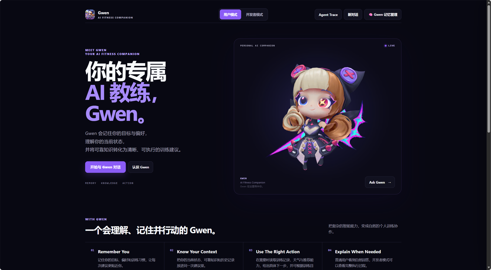
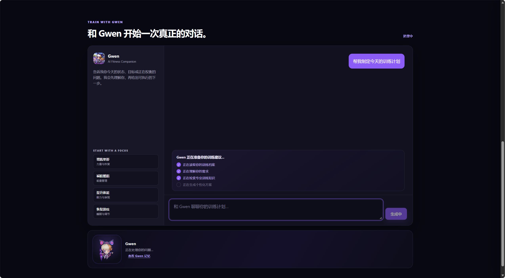
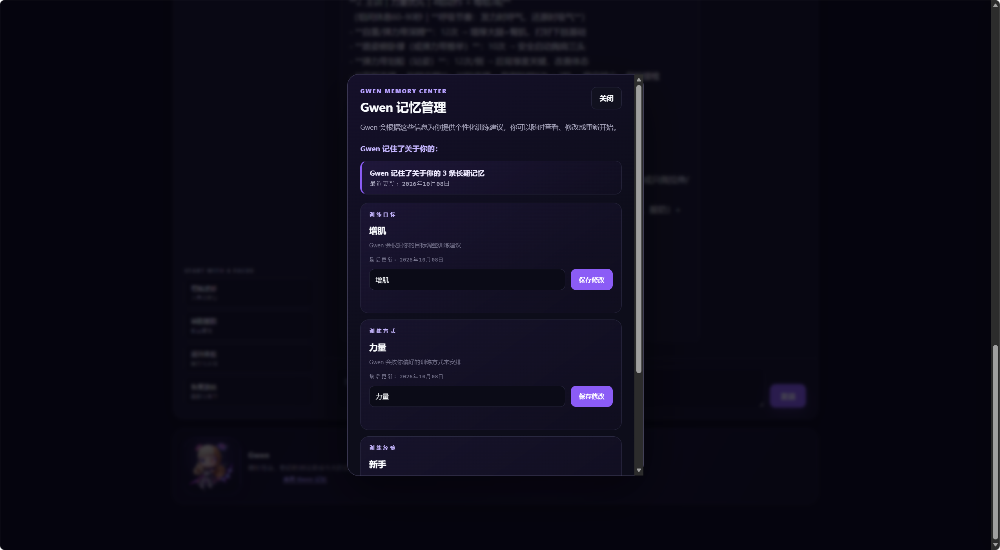
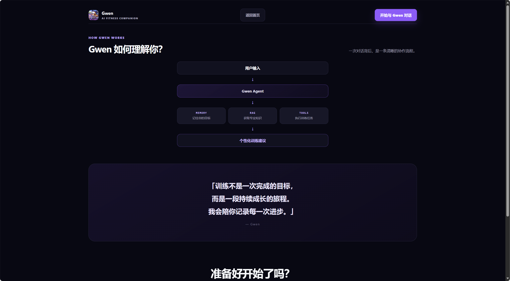
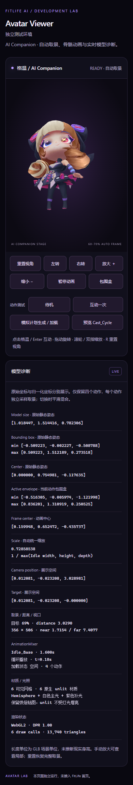

# Gwen AI Fitness Agent

### Your Personal AI Fitness Companion

一个基于 **LLM Agent + LangGraph + RAG + Long-term Memory** 的智能健身 Agent，能够理解用户目标、记忆训练习惯，并生成个性化训练建议。

> **Project positioning:** From a stateless chatbot to an observable, memory-aware, knowledge-grounded AI Agent.

<!-- Logo / Banner placeholder -->


<p align="center">
  <em>Project Logo / Hero Banner</em><br>
  <sub>Replace this area with a branded 1200×420 banner or the Gwen Avatar hero image.</sub>
</p>


---

## 项目一句话

Gwen 把一次性的健身问答，升级成一个**理解上下文、保留长期记忆、检索可靠知识、调用受控工具并记录完整执行过程**的个人 AI Fitness Agent。

## Demo 截图


| Web UI | Agent Trace |
| --- | --- |
|  |  |

| Memory Center | About Gwen |
| --- | --- |
|  |  |

### Mobile Demo



> 以上截图展示 Gwen Web UI、Agent Trace、Memory Center 和 About 页面的项目体验。

## Highlights

- **LLM Agent**：面向训练、营养、恢复场景的个性化对话 Agent，结合用户画像、上下文与工具结果生成回答。
- **LangGraph Workflow**：使用显式状态机编排 Profile、Memory、RAG、Intent、Tool Calling、Response 与 Persistence。
- **Long-term Memory**：短期会话与长期 `UserMemory` 分离，支持记住用户目标、训练偏好和经验等级。
- **RAG Knowledge Base**：Markdown 知识库 + Embedding + FAISS Top-K 检索，为回答补充可追溯的专业健身知识。
- **Tool Calling**：受控工具注册表支持训练记录、训练推荐和天气查询，并对参数、调用次数和执行轮次进行约束。
- **Agent Trace**：记录节点生命周期、耗时、工具交互、Memory/RAG 证据和停止原因，便于调试、演示和评估。
- **Product-oriented Frontend**：FastAPI + Web UI + Gwen 3D Avatar，展示 Agent 如何与用户交互以及如何暴露执行过程。
- **Safety by design**：不把真实 API Key、数据库或用户数据提交到仓库，工具参数不允许伪造用户上下文。

## 为什么需要 Agent？

传统 Chatbot 通常只能基于当前输入生成泛化回答，无法稳定地：

- 识别用户当前目标和训练阶段；
- 记住用户长期偏好；
- 查阅可靠知识并给出有依据的建议；
- 根据需要调用训练数据或其他工具；
- 让用户理解回答背后经过了哪些步骤。

Gwen 通过 **Agent State + Workflow + Memory + RAG + Tools + Trace**，将这些能力组合为可观察、可测试、可扩展的系统，而不是把所有逻辑塞进单个 Prompt。

## Agent 如何工作？

```text
User Input
   │
   ▼
┌──────────────────────────────────────────────┐
│ LangGraph Agent Workflow                     │
│                                              │
│ load_profile ──> memory_retrieve ──> rag_    │
│                                      retrieve│
│      │                                      │
│      ▼                                      │
│   intent ──> tool_decision                  │
│                 │             │             │
│          tool_execution      response      │
│                 │             │             │
│                 └──> memory_update          │
│                          │                  │
│                          ▼                  │
│               conversation_persistence      │
└──────────────────────────────────────────────┘
   │
   ▼
Answer + Agent Trace
```

1. **Profile**：读取用户画像，补充昵称、训练等级、目标等上下文。
2. **Memory Retrieval**：合并短期对话和长期记忆，让回答保持个性化连续性。
3. **RAG Retrieval**：从训练、营养和恢复知识库中检索相关来源。
4. **Intent / Reasoning**：理解问题属于训练、营养、恢复、生活方式或一般对话。
5. **Tool Decision**：判断是否需要查询训练记录、生成训练推荐或获取天气。
6. **Tool Execution**：执行经过 schema 校验的工具调用，并将结果回写状态。
7. **Response**：综合画像、记忆、知识和工具结果生成回答。
8. **Memory Update / Persistence**：提取持久信息，保存会话，并输出 Trace。

## Memory 如何实现？

Memory 被拆成三个清晰层次：

| 层次 | 实现 | 作用 |
| --- | --- | --- |
| Short-term Memory | `ConversationTurn` / `conversation_history` | 保留当前会话上下文 |
| Long-term Memory | `UserMemory` / `MemoryService` | 保存目标、偏好、经验等级等持久事实 |
| Memory Boundary | `MemoryServiceInterface` | 让 Agent 与存储实现解耦，方便替换或扩展 |

Agent 每次运行都会从 Memory 读取上下文；回答完成后通过 Memory Update 节点提取值得长期保留的信息。Memory Center 还提供查看、更新和重置能力，便于展示和调试。

## RAG 如何增强知识？

```text
knowledge/*.md
      │
      ▼
Document Loader ──> Chunking ──> Embedding ──> FAISS
                                               │
User Query ────────────────────────────────> Top-K Search
                                               │
                                               ▼
Source-aware RAG Context ──> LangGraph Response
```

RAG 不是简单的关键词拼接，而是保留 `source`、`content` 和 `score`，让回答具备来源意识。这样可以：

- 把项目知识库与通用 LLM 能力结合；
- 针对训练、营养、恢复问题提供更具体的上下文；
- 在 Trace 中展示命中的知识片段和来源；
- 为后续评估 groundedness、引用和检索质量提供基础。

## Workflow 如何编排？

LangGraph 负责**状态流转和分支控制**，而不是只调用一次 LLM：

- `AgentState` 统一传递用户输入、画像、Memory、RAG、工具调用、工具结果和回答草稿；
- `tool_decision` 在“直接回答”和“调用工具”之间路由；
- 工具循环受最大轮次和最大调用数限制，避免失控调用；
- `memory_update` 和 `conversation_persistence` 作为独立节点收尾；
- Agent Trace 在不改变业务逻辑的前提下观察每个节点。

这种设计将 Prompt、模型调用、检索、工具执行和持久化解耦，便于测试、调试和替换模型。

## 技术架构

```text
┌──────────────────────────┐
│ Web UI + Gwen 3D Avatar  │
└────────────┬─────────────┘
             │ HTTP / SSE
┌────────────▼─────────────┐
│ FastAPI API + Agent Trace│
└────────────┬─────────────┘
             │
┌────────────▼─────────────┐
│ LangGraph LLM Agent      │
│ Profile | Memory | RAG   │
│ Intent | Tools | Response│
└───┬───────────┬──────┬───┘
    │           │      │
    ▼           ▼      ▼
 SQLite      FAISS    LLM / Embedding
 Memory      Knowledge  OpenAI-compatible
 Turns       Base       DashScope
```

更多模块边界和扩展点见 [`ARCHITECTURE.md`](ARCHITECTURE.md)。

## 项目亮点

### 1. Agent-first 设计

不是“给 Chat API 加一个提示词”，而是从 State、Node、Tool、Memory、RAG 和 Trace 出发设计 Agent 生命周期。

### 2. 可观察性

Trace 展示节点级执行过程和证据，适合面试中解释“模型为什么这样回答”以及如何定位 Agent 失败。

### 3. 可替换边界

LLM Gateway、Memory Repository、Embedding Provider、Vector Store 和 Tool Registry 都有明确接口，便于迁移模型或扩展基础设施。

### 4. 可评估性

测试覆盖 Agent Graph、Memory、RAG、Tool Calling、API、Trace 和前端行为，并包含 Tool Selection 与 Response Quality 评测用例。

### 5. 产品化表达

后端 Agent 能力与 Web UI、3D Avatar、Memory Center 和 Agent Trace 结合，展示的是一个完整的 AI 产品体验，而不只是 Notebook 或 Demo 脚本。

## 面试介绍版本

> **30 秒版本**
>
> Gwen AI Fitness Agent 是一个基于 LangGraph 的个人健身 AI Agent。它会先读取用户画像和长期记忆，再从 RAG 知识库检索训练、营养和恢复知识，然后判断是否调用训练记录或天气工具，最后生成个性化回答，并通过 Agent Trace 暴露完整执行过程。它重点解决传统 Chatbot 缺少长期上下文、知识依据、工具能力和执行可观测性的问题。

> **2 分钟版本**
>
> 这个项目把健身助手设计成一个完整的 Agent 系统。用户输入进入 LangGraph 后，依次经过 Profile、Memory Retrieval、RAG Retrieval、Intent、Tool Decision、Tool Execution、Response、Memory Update 和 Conversation Persistence。Memory 使用短期会话加长期用户事实，RAG 使用 Markdown 知识库加 FAISS 检索，Tools 通过 schema 和运行时上下文限制执行，Agent Trace 则记录节点耗时、工具交互和证据。这样的边界让模型、存储、检索和工具都可以独立演进，也让我可以测试 Agent 的准确性、groundedness 和安全性，而不是只看最终文本效果。

> **项目价值**
>
> - 体现 LLM 应用从 Prompt Demo 到 Agent 系统的工程化；
> - 体现 LangGraph 的状态编排、条件路由和受控循环；
> - 体现 Long-term Memory 与 RAG 如何共同提升个性化和知识质量；
> - 体现 Tool Calling、API、前端和 Trace 的端到端整合；
> - 体现测试、评估、安全边界和可观测性意识。

## 技术栈

- **Agent Orchestration**：Python、LangGraph、LangChain Callbacks
- **LLM Integration**：OpenAI-compatible SDK、阿里云百炼 / DashScope
- **RAG**：FAISS、NumPy、Embedding API、Markdown Knowledge Base
- **Backend**：FastAPI、Uvicorn、Pydantic、SQLAlchemy
- **Persistence**：SQLite（开发默认）
- **Frontend**：JavaScript、ES Modules、Three.js、GLB Avatar
- **Quality**：pytest、pytest-asyncio、Ruff

## 快速运行

```powershell
cd "D:\AI agent2\fitlife-ai"
python -m venv .venv
.venv\Scripts\Activate.ps1
python -m pip install --upgrade pip
python -m pip install -e ".[dev]"
Copy-Item .env.example .env
python -m uvicorn app.main:app --reload --host 127.0.0.1 --port 8000
```

- Web UI：[http://127.0.0.1:8000/](http://127.0.0.1:8000/)
- Swagger UI：[http://127.0.0.1:8000/docs](http://127.0.0.1:8000/docs)

运行测试：

```powershell
python -m pytest
python -m ruff check app tests
```

## GitHub Topics

推荐在 GitHub 仓库 About 区域添加以下 Topics：

```text
ai-agent
llm
langgraph
rag
large-language-model
fastapi
python
fitness-ai
```

## GitHub About

**Description:**

```text
An AI Fitness Companion powered by LLM Agent, LangGraph, RAG and Long-term Memory.
```

**Website:**

```text
https://github.com/Xx-77-Star/gwen-ai-fitness-agent
```

## 项目结构

```text
fitlife-ai/
├── app/
│   ├── agent/          # LangGraph workflow、AgentState、Tool Calling
│   ├── memory/         # Long-term memory、conversation persistence
│   ├── rag/            # Chunking、Embedding、FAISS retrieval
│   ├── tools/          # Training / recommendation / weather tools
│   ├── observability/  # Agent Trace、SSE events、structured logs
│   └── api/routes/     # Chat、Memory、Profile、Training、Health API
├── frontend/           # Gwen Web UI、Agent Trace Drawer、3D Avatar
├── knowledge/          # Training、nutrition、recovery knowledge base
├── tests/              # Agent、Memory、RAG、Tools、API、Trace tests
├── ARCHITECTURE.md
├── .env.example
├── .gitignore
└── README.md
```

## 安全与边界

- `.env`、数据库文件、日志、缓存和 IDE 配置不会被提交。
- 真实 API Key 只应保存在本地 `.env`，不要写入 README、代码或测试数据。
- Agent 输出用于一般健身信息和训练协作，不构成医疗诊断或治疗方案。
- 涉及持续疼痛、伤病或疾病时，应咨询医生或合格专业人员。

## 未来规划

- Long-term Memory：置信度、过期策略、遗忘机制和用户可控编辑。
- RAG：增量索引、引用式回答、检索评估和来源版本管理。
- Tools：饮食记录、训练计划生成、周期化推荐和 MCP 外部工具。
- Observability：OpenTelemetry、Trace 导出、运行回放、成本和延迟指标。
- Production：认证授权、数据库迁移、部署配置、监控告警和多用户隔离。

## License

如需公开发布，请补充适合项目的 LICENSE 文件，并确认第三方组件许可证与资源授权。


